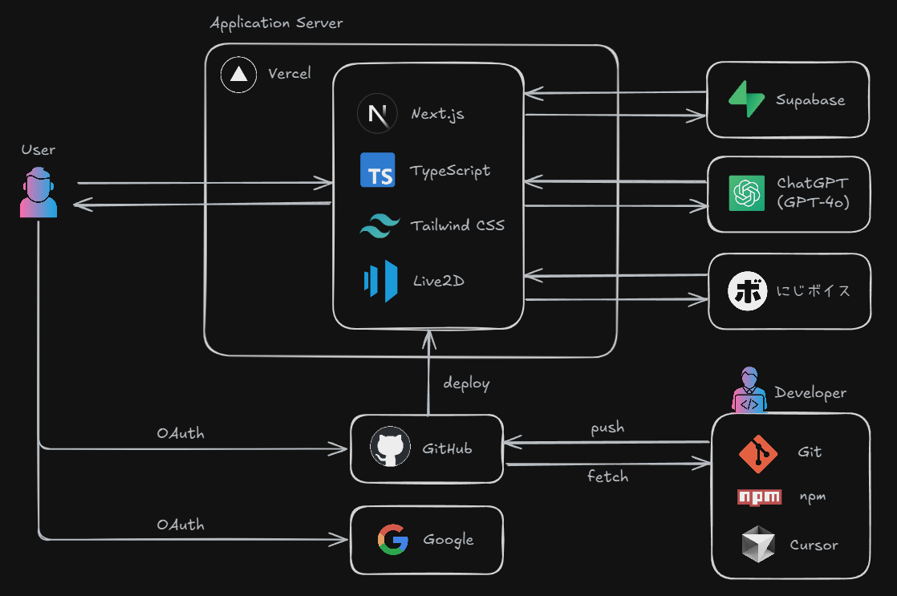

# With You

with you は美少女AIと会話できるアプリです。  
少女はあなたの味方です。日頃の何気ない会話や悩み事などに真摯に向き合います。

## 技術スタック

| 種別                   | 技術              | 備考              |
| ---------------------- | ----------------- | ----------------- |
| 言語                   | React、TypeScript |                   |
| フレームワーク         | Next.js           | App Router を使用 |
| パッケージマネージャー | npm               |                   |
| リンター               | ESLint            |                   |
| フォーマッター         | Prettier          | 　                |
| CSS フレームワーク     | Tailwind CSS      |                   |
| 認証ライブラリ         | Auth.js           | 旧NextAuth.js     |
| DB                     | Supabase          |                   |
| ORM                    | Prisma            |                   |
| キャラクター           | Live2D            |                   |
| AI                     | ChatGPT           | GPT-4o            |
| 音声生成               | にじボイス        |                   |

## アーキテクチャ



## 開発環境の構築

.env.exampleをコピーして.envを作成してください。  
.envに各種APIキーを記述してください。

### Step 2

依存するパッケージをインストールします。

```bash
npm install
```

### Step 3

開発サーバを起動します。

```bash
npm run dev
```

ブラウザで[http://localhost:3000](http://localhost:3000)にアクセスしてください。

## 本番環境のビルド

### Step 1

ソースコードを本番環境用にビルドします。

```bash
npm run build
```

### Step 2

サーバを起動します。

```bash
npm run start
```

## 参考

詳細は各種ドキュメントを参照してください。

- [Next.js](https://nextjs.org/docs)
- [Tailwind CSS](https://tailwindcss.com/docs)
- [Auth.js](https://authjs.dev/)
- [Live2D](https://www.live2d.com/)
- [ChatGPT](https://openai.com/ja-JP/index/openai-api/)
- [にじボイス](https://nijivoice.com/)
